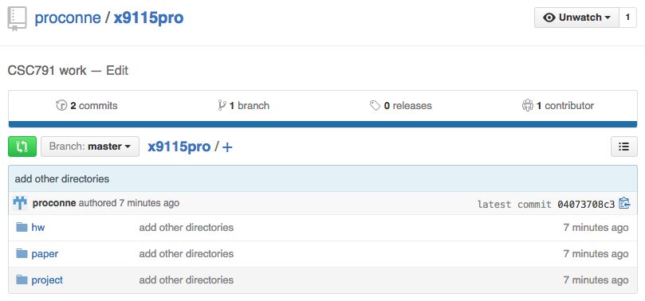
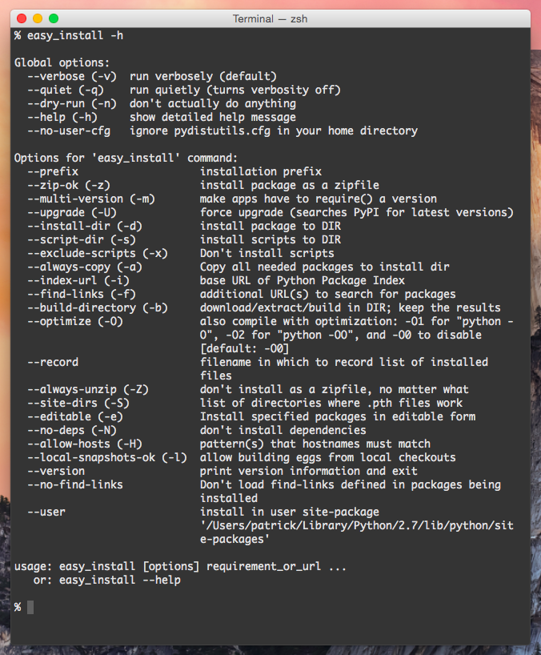

Code1
=====

Top level of repository
-----------------------

Python version
--------------

Pip help
--------

Easy\_install help
------------------

Test output (and syntax highlighting)
-------------------------------------

