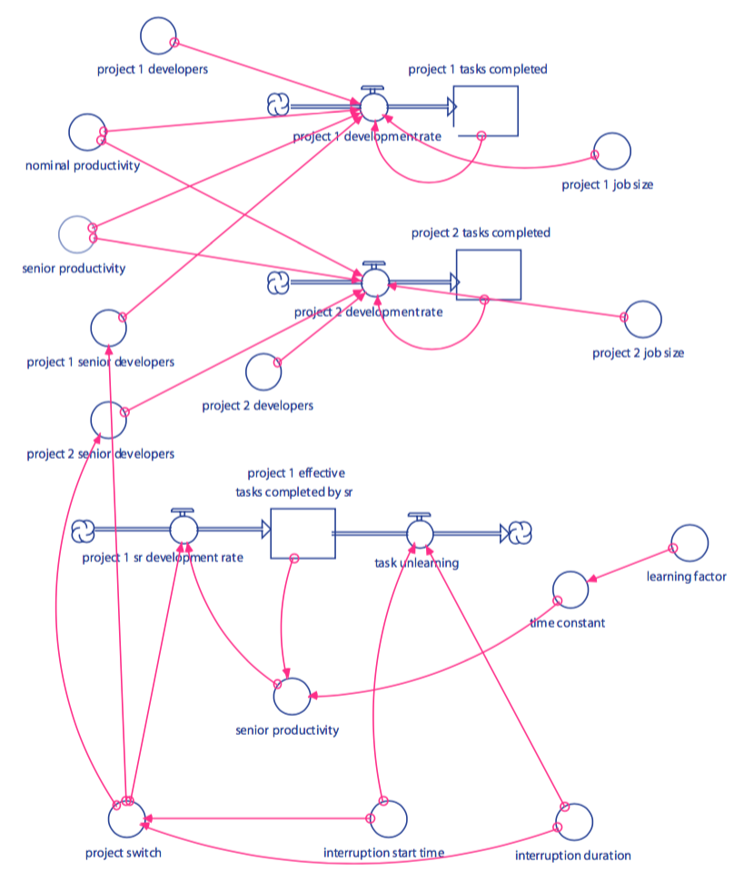

## Solving Project Contention Using Multiobjective Evolutionary Algorithms

### Introduction

#### Project Contention

Project contention deals with the challenges of allocating resources between
different projectts. Often, it is tempting to transfer resources such as
manpower from one project to another in order to complete short-term goals
quickly. However, this can have an adverse effect on individual productivity
which can be harmful in the long term. This was studied by software engineers
at Litton Industries as described by Raymond Madachy in the book Software
Process Dynamics.

### Related Work

TODO

### Background

#### Multiobjective Evolutionary Algorithms

Multiobjective evolutionary algorithms, or MOEAs, are evolutionary algorithms
which are used when each solution has multiple objectives (measures of quality)
by which they can be compared. Single-objective algorithms can also be used for
multiple-objective functions by defining an objective which is a weighted
combination (or any function) of the original objectives. However, this
approach is restrictive in that it forces the user to choose weights for each
objective, which are often not known a priori. In addition, it is often
desirable to obtain many different solutions from the algorithm, each of which
is better than the others in some way.

### Model

