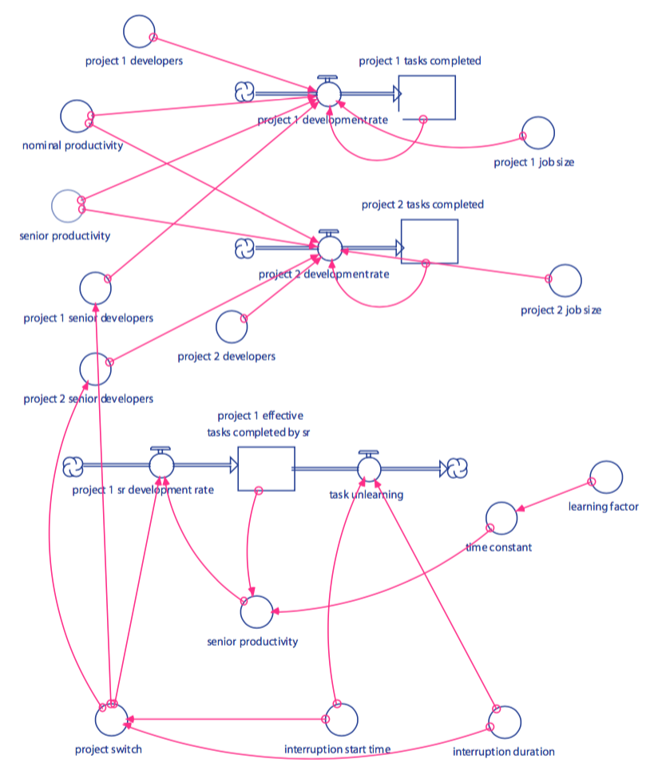
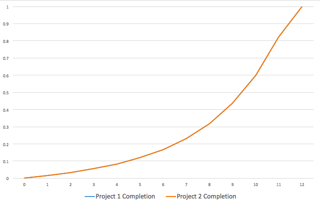
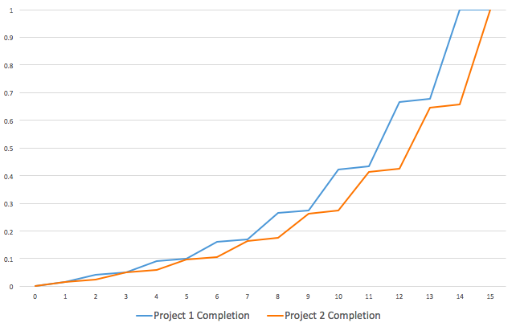
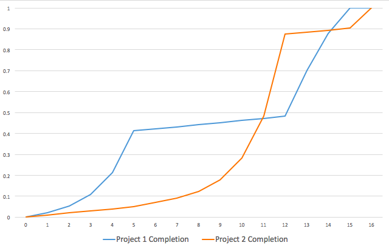
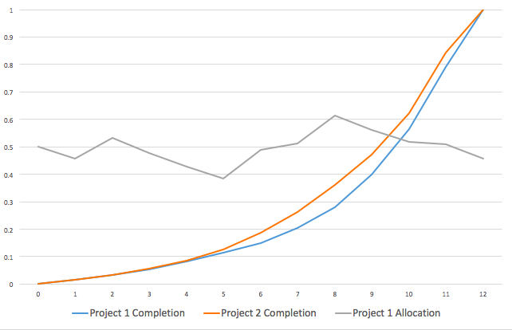
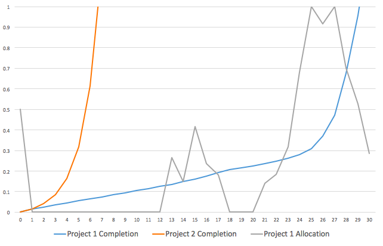
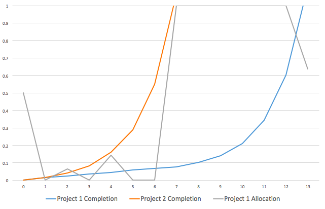
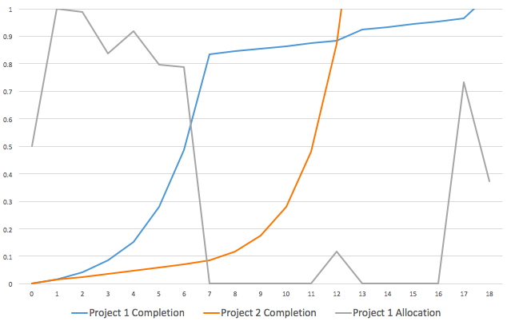
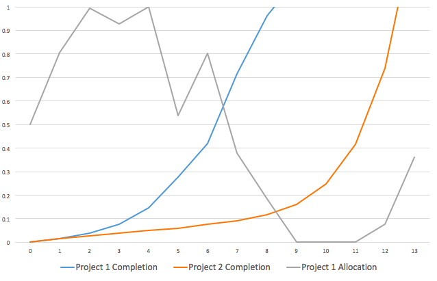

## Solving Project Contention Using Multiobjective Evolutionary Algorithms

##### Patrick O'Connell

### Introduction

#### Project Contention

Project contention deals with the challenges of allocating resources between
different projects. Often, it is tempting to transfer resources such as
manpower from one project to another in order to complete short-term goals
quickly. However, this can have an adverse effect on individual productivity
which can be harmful in the long term, as when developers switch tasks it
takes some time for them to become familiar with the new one and reach their
maximum productivity. This was studied by software engineers at Litton
Industries as described by Raymond Madachy in the book Software Process
Dynamics.

### Related Work

TODO

### Background

#### Multiobjective Evolutionary Algorithms

Multiobjective evolutionary algorithms, or MOEAs, are evolutionary algorithms
which are used when each solution has multiple objectives (measures of quality)
by which they can be compared. Single-objective algorithms can also be used for
multiple-objective functions by defining an objective which is a weighted
combination (or any function) of the original objectives. However, this
approach is restrictive in that it forces the user to choose weights for each
objective, which are often not known a priori. In addition, it is often
desirable to obtain many different solutions from the algorithm, each of which
is better than the others in some way.

#### NSGA-II

The optimization algorithm used was NSGA-II, which stands for nondominated
sorting genetic algorithm (version II). Like any genetic algorithm, NSGA-II
works by maintaining a set of candidate solutions (the population) while
generating new ones by combining and mutating previous solutions, and taking
the best solutions of one generation for use in generating the next. The
defining characteristic of NSGA-II is how it chooses the solutions to keep in
the next generation.

To do this, NSGA-II uses the concept of domination: one solution dominates
another if it does at least as well for every objective. This is not a total
ordering, as if one solution does better on one objective and the other does
better on another objective (which is often the case) neither dominates the
other.

NSGA-II partitions the population into "nondomination levels" where no solution
on a certain level dominates another solution on that same level, and all
solutions on a level dominate the solutions on lower levels. At each iteration,
the new population is made up of the best nondomination levels, however many of
which are required for the correct population size.

When only part of a level is needed based on the population size, solutions are
chosen to maximize a second objective, which is diversity. NSGA-II defines a
metric called the "crowding distance" which takes solutions from diverse parts
of the boundary in order to explore more of the search space.

### Model

The model being studied deals with contention between two projects, each of
which starts with the same number of developers and the same amount of work
left to do. The combined team consists of a fixed number of senior developers
which may be transferred between projects.

As the senior developers work on a project their familiarity with the project,
and consequently their productivity, increase. If they are transferred to the
other project, they gradually forget about the first, and their productivity
slowly returns to its base level. This simulates the effect discussed above,
where switching between tasks decreases the productivity of developers.

The diagram above, taken from the book Software Process Dynamics, shows the
model using iThink notation. The flows to the "project 1 tasks completed" and
"project 2 tasks completed" represent the rate of development of the two
projects. These rates depend on many things, the most important of which are
the allocation of senior developers and the closely related "senior
productivity", which depends on how long the seniors have been allocated to
their current projects as described earlier.

The input to the model is the "project switch" variable which defines the
change over time in allocation of developers to each project. This is a
function that varies over time, and the goal of the optimization algorithm is
to find a switching schedule that maximizes the objective functions.

#### Objectives

The model consists of six objective functions:
  - `obj1`: Time for Project 1 to achieve 40% completion
  - `obj2`: Time for Project 1 to achieve 70% completion
  - `obj3`: Time for Project 2 to achieve 50% completion
  - `obj4`: Time for Project 1 to finish
  - `obj5`: Time for Project 2 to finish
  - `obj6`: Time for both projects to finish (`max(obj4, obj5)`)

The first three represent intermediate milestones where, for example, a
customer demanded that development reached a certain usable state as soon as
possible.

It is not possible to minimize all of these objectives simultaneously; for
example, `obj4` and `obj5` are directly competing, and attempting to improve
`obj1`, `obj2` and `obj3` will typically worsen performance on `obj6`. A MOEA
can be used to obtain a variety of solutions, each of which yields the best
or near-best results on a subset of the objectives, and the correct solution
can then be chosen based on the goals.

#### Example Runs

The following graphs show the project completion over time of both projects for
some simple, fixed allocation schedules.

Keeping the initial allocation of half the senior developers to each project:

Switching all of the senior developers between projects at each timestep:

Switching all of the senior developers to the project with the next deadline
(all to Project 1 initially, all to Project 2 when Project 1 achieves 40%
completion, etc.):

### Results

The following section shows the project completion graphs of schedules that
were output by the optimizer. To choose these solutions, a score function was
defined as a linear combination of the original objective functions, and the
solution from the population which maximizes the score function was chosen (the
new score function was not used directly by the optimizer, only to choose from
the population which was output by NSGA-II).

`score = -obj6`
This minimizes the completion time for both projects. The solution
approximately maintains a constant 50% of developers assigned to each.

`score = -obj5`
This completes Project 2 as soon as possible. The erratic behavior of the
allocation after Project 2 has finished is due to the fact that the score
function does not consider the completion time of Project 1 at all.

`score = -obj4 - obj5`
This minimizes the sum of the time taken to complete both projects. Despite the
fact that it seems similar to the first test (finishing the last project
as soon as possible) the optimizer chooses to assign all senior developers to
Project 1 initially, and switches them to Project 2 when it finishes. This
scores better than keeping a 50/50 split by about 5 points.

`score = -obj1 - obj2 - obj5`
This score function aims to complete both milestones for Project 1 as soon
as possible, but then to complete Project 2 as soon as possible after that. As
would be expected, it initally allocates all resources to Project 1, and
switches them to Project 2 when the second milestone (70% completion) is
reached.

`score = -obj1 - obj2 - obj3 - obj4 - obj5 - obj6`
The last score function attempts to minimize all objectives simultaneously
with equal weights. It appears to follow the same strategy as the third test,
finishing one project quickly and switching resources to the other, although
the transition is more gradual. The fact that it completes Project 1 first is
probably significant due to the fact that there are two early milestones for
Project 1 and only one for Project 2.

